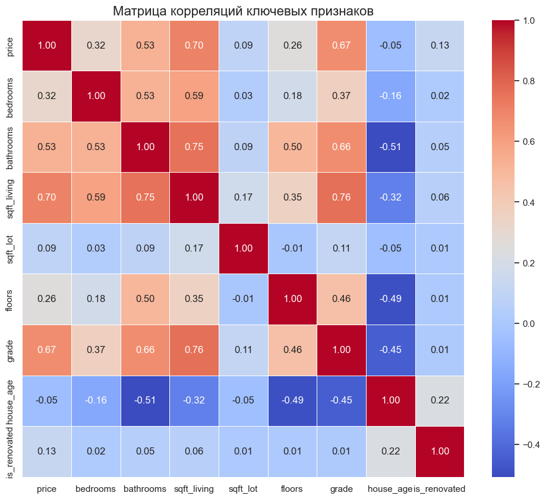
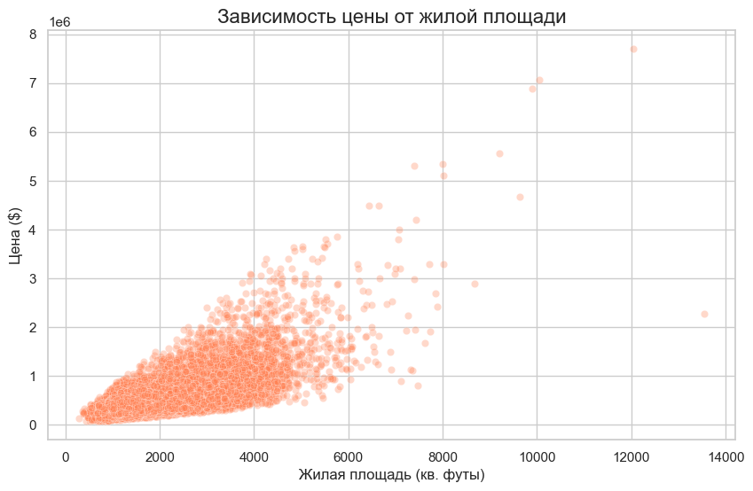

# 🏡 Анализ рынка недвижимости: House Sales in King County (Сиэтл, США)

## 📌 Описание проекта
В этом проекте я провел комплексное исследование исторических данных о продажах недвижимости в округе Кинг. 

Основная цель проекта — выявить ключевые драйверы ценообразования, проверить бизнес-гипотезы статистическими методами и построить предсказательную модель машинного обучения (ML) для оценки стоимости жилья. Проект охватывает полный цикл работы: от предобработки "грязных" данных и Feature Engineering до выбора оптимального ML-алгоритма для потенциального внедрения в продакшен.

## 🛠️ Стек технологий
* **Язык:** Python
* **Анализ и статистика:** Pandas, NumPy, SciPy (A/B testing)
* **Машинное обучение:** Scikit-Learn (Linear Regression, Random Forest)
* **Визуализация:** Matplotlib, Seaborn
* **Инструменты разработки:** Jupyter Notebook, Git

## 📊 Ключевые выводы и бизнес-инсайты

1. **Особенности распределения цен:** Рынок имеет ярко выраженный правый скос. Медианная цена составляет ~$450,000, однако среднее значение сильно завышено (~$540,000) из-за наличия элитной недвижимости (выбросов). Это обуславливает выбор устойчивых к выбросам метрик в дальнейшем анализе.
2. **Линейные vs Нелинейные драйверы стоимости:** 
   * Классический корреляционный анализ (Pearson) показал, что сильнейшую линейную связь с ценой имеет **жилая площадь** (r = 0.70).
   * При этом анализ Feature Importance с помощью Random Forest выявил, что нелинейный признак **качества постройки (Grade)** вносит даже больший вклад в итоговую стоимость, что логично для премиум-сегмента.
3. **Проверка гипотез (Влияние реновации):** С помощью непараметрического U-критерия Манна-Уитни (выбран из-за ненормального распределения цен) было статистически доказано (p-value < 0.05), что дома с реновацией стоят значимо дороже аналогов без нее.
4. **Выбор ML-модели:** Я обучил и сравнил Linear Regression и Random Forest Regressor. Разница в качестве предсказания ($R^2$) составила всего ~0.005. С точки зрения бизнеса, для внедрения в продакшен рекомендована **Линейная Регрессия** благодаря высокой скорости работы (low latency) и 100% интерпретируемости (explainability) формулы для заказчика.

## 📈 Визуализация данных

### Матрица корреляций признаков

### Зависимость цены от площади жилья

## 📁 Структура репозитория
* `data/` — директория с исходными данными (добавлена в .gitignore)
* `notebooks/` — Jupyter Notebook с полным кодом исследования (EDA, статистика, ML)
* `images/` — сохраненные графики для отчета
* `README.md` — описание проекта и выводы
* `requirements.txt` — зависимости проекта для воспроизводимости среды
